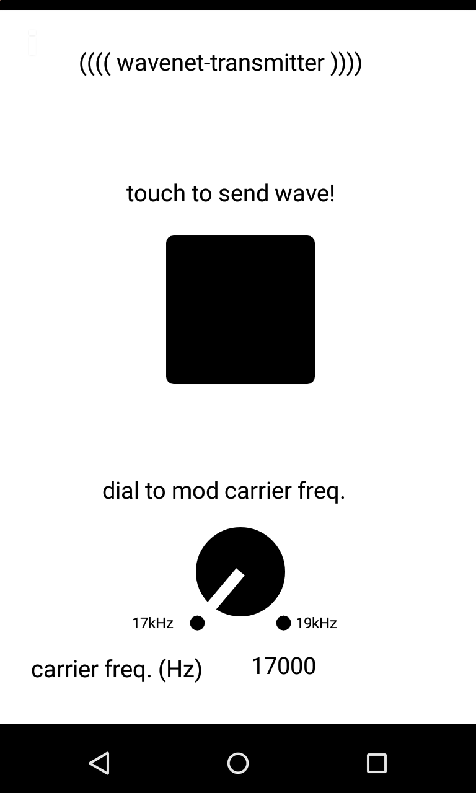
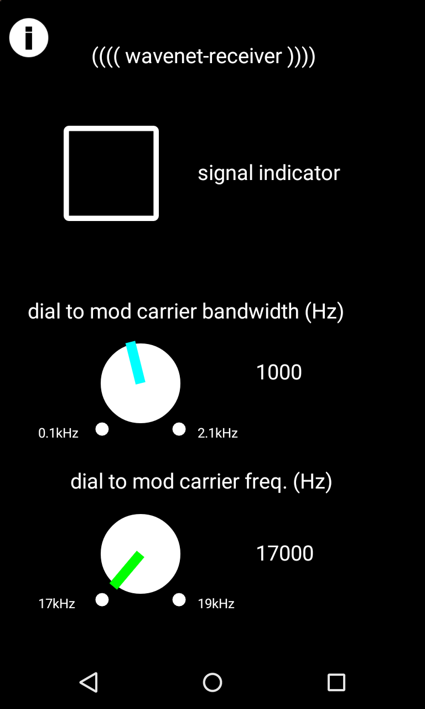
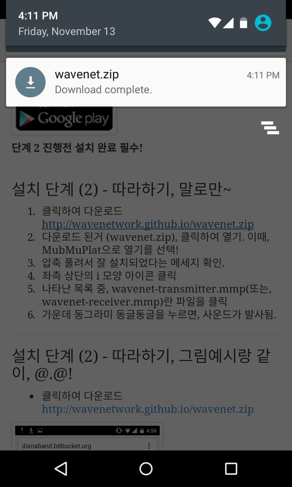
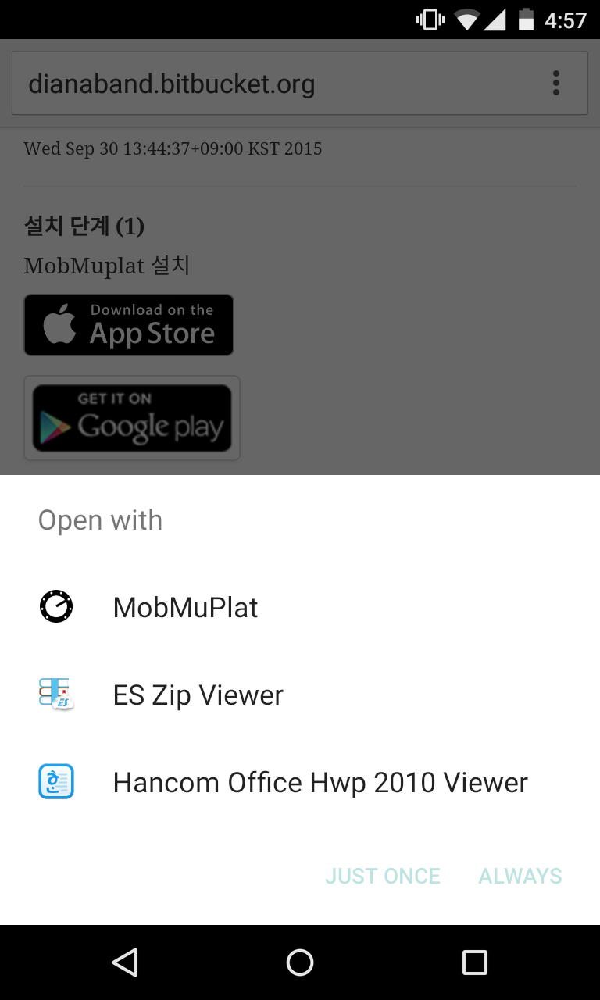
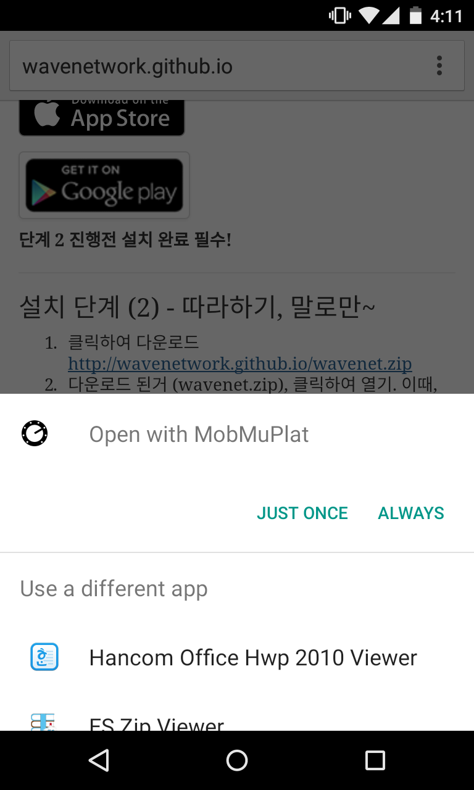
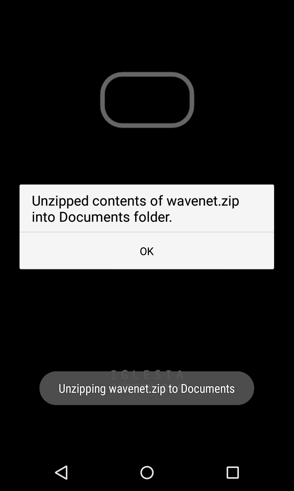
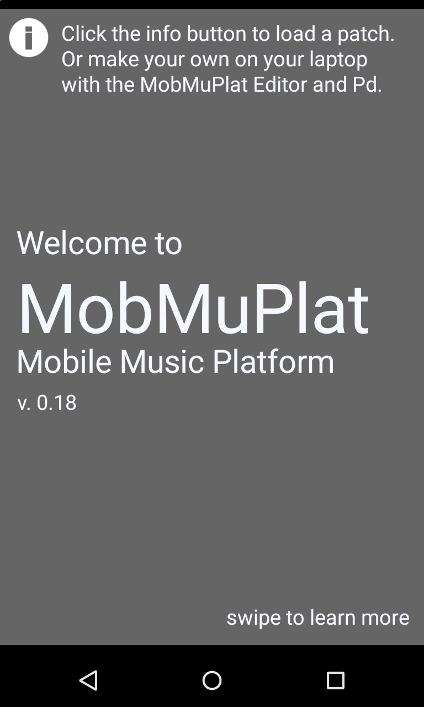
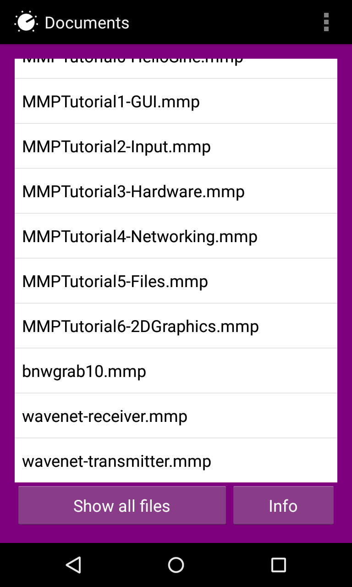
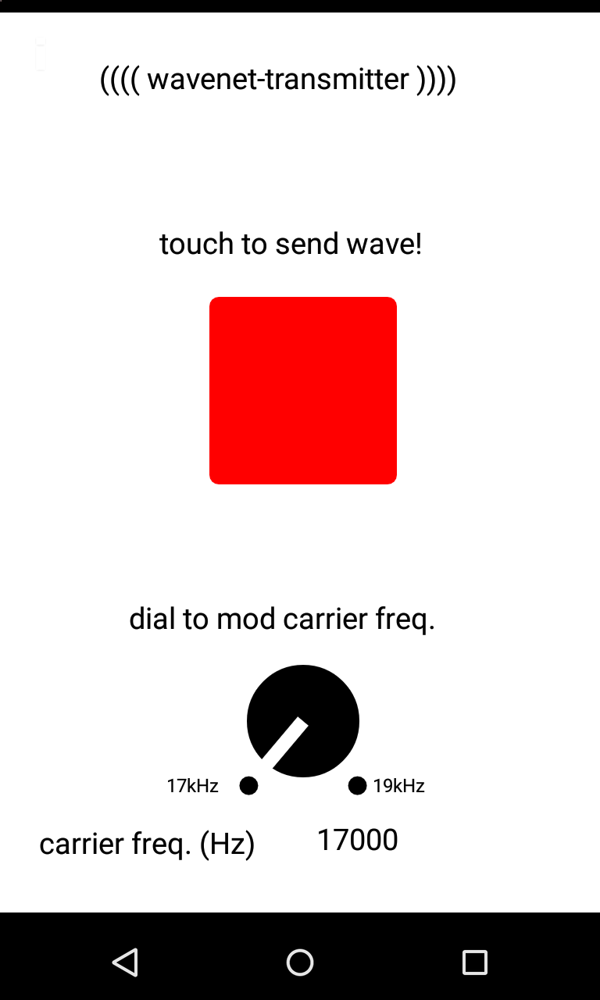

## wavenet 사용 매뉴얼 (TESTING)

```
[>> English-version](index-eng.md) // UNIMPLEMENTED
```

---

### 소개

#### 발신기



요걸로, 17~19kHz 까지 주파수를 선택해서 발신. 발신기.

#### 수신기



요걸로, 17~19kHz 까지 주파수를 선택해서 수신. 수신기.
패스밴드의 폭을 0.1~2.1kHz까지 가변할 수 있음.
기타 신호감지를 개선하는 기능 계속 추가해 나가야할 듯.

#### 패스밴드에 대해서...

원하는 주파수만을 강조하기 위해, 다른 주파수 대역의 소리의 크기를 죽이는 필터를 사용하는데.
high pass filter 가 4개, low pass filter 가 4개 사용됨. (== bandpass filter 4개라고 말해도 되공...)
이 두 필터 세트의 중심 주파수를 수신하고자 하는 주파수의 주변에 배치해서.. 원하는 주파수를 포함하는 특정 밴드(band)의 소리만을 듣는다.

이 밴드의 폭을 100Hz에서 2.1kHz 까지, 좁게 혹은 넓게 설정할 수 있다는 말임.
아래 그림 참고.


출처 : <https://en.wikipedia.org/wiki/Bandwidth_(signal_processing)#X-dB_bandwidth>

이렇게 해본 이유는, 필터의 효과가 사실은 원하는 주파수 대역에도 신호감쇄의 효과를 미치기 때문에, 100Hz 처럼, 정확하게 신호를 잡아내려고 하면, 그만큼 들리는 신호의 크기도 작아지는 효과가 있지 않을까 염려되어서, 밴드폭을 바꿔보면서, 테스트해볼 필요가 있다고 생각했기 때문임. (사실, 잠깐 실험해 본 바로는 별로, 상관이 없는 것 같아 보였음)

---

### 설치 단계 (1) - MobMuplat 설치

---

<a href="https://geo.itunes.apple.com/us/app/mobmuplat/id597679399?mt=8" style="display:inline-block;overflow:hidden;background:url(http://linkmaker.itunes.apple.com/images/badges/en-us/badge_appstore-lrg.svg) no-repeat;width:165px;height:40px;"></a>

<a href="https://play.google.com/store/apps/details?id=com.iglesiaintermedia.mobmuplat">

</a>

**단계 2 진행전 설치 완료 필수!**

---

### 설치 단계 (2) - 따라하기, 말로만~

1. 클릭하여 다운로드 <http://wavenetwork.github.io/wavenet.zip>
2. 다운로드 된거 (wavenet.zip), 클릭하여 열기. 이때, MubMuPlat으로 열기를 선택!
3. 압축 풀려서 잘 설치되었다는 메세지 확인.
4. 좌측 상단의 i 모양 아이콘 클릭
5. 나타난 목록 중, wavenet-transmitter.mmp(또는, wavenet-receiver.mmp)란 파일을 클릭
6. 발신기 앱의 가운데 버튼을 누르면, 신호가 발사됨.
7. 수신기 앱의 가운데 버튼에 빨간 불이 켜지면, 신호가 수신된 것임.

---

### 설치 단계 (2) - 따라하기, 그림예시랑 같이, @.@!

* 클릭하여 다운로드 <http://wavenetwork.github.io/wavenet.zip>


* 다운로드 된거 (wavenet.zip), 클릭하여 열기. 이때, MubMuPlat으로 열기를 선택!





* 압축 풀려서 잘 설치되었다는 메세지 확인.



* 좌측 상단의 i 모양 아이콘 클릭



* 나타난 목록 중, wavenet-transmitter.mmp(또는, wavenet-receiver.mmp)란 파일을 클릭



* 발신기 앱의 가운데 버튼을 누르면, 신호가 발사됨.



* 수신기 앱의 가운데 버튼에 빨간 불이 켜지면, 신호가 수신된 것임.


---

- Git repository : <https://github.com/wavenetwork/wavenetwork.github.io>

---